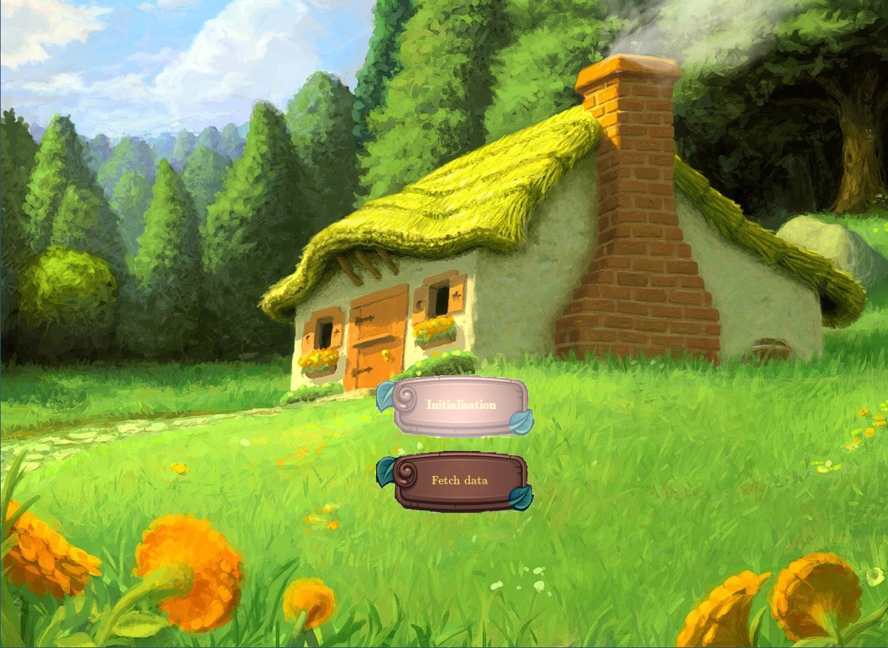
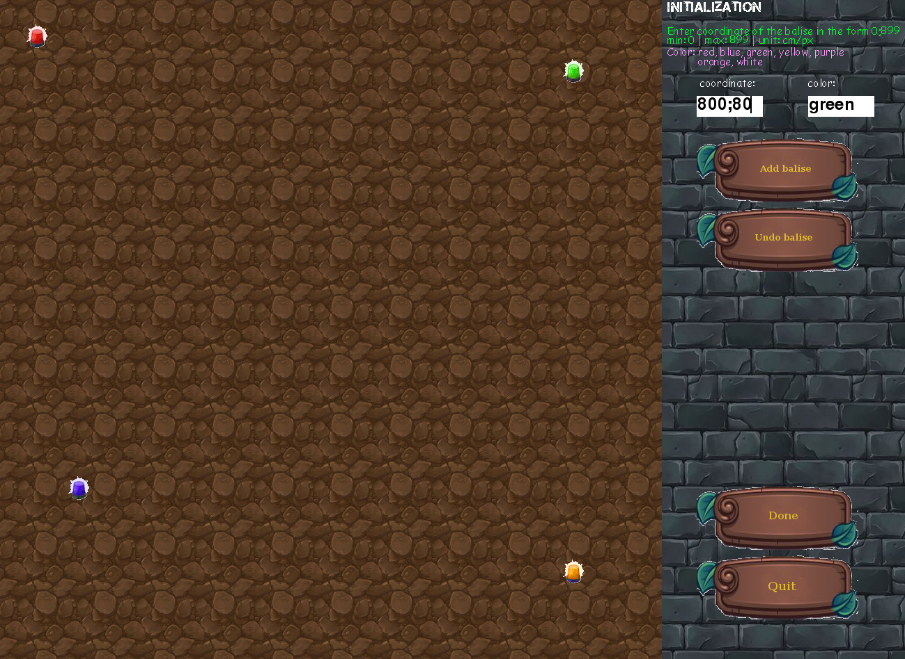
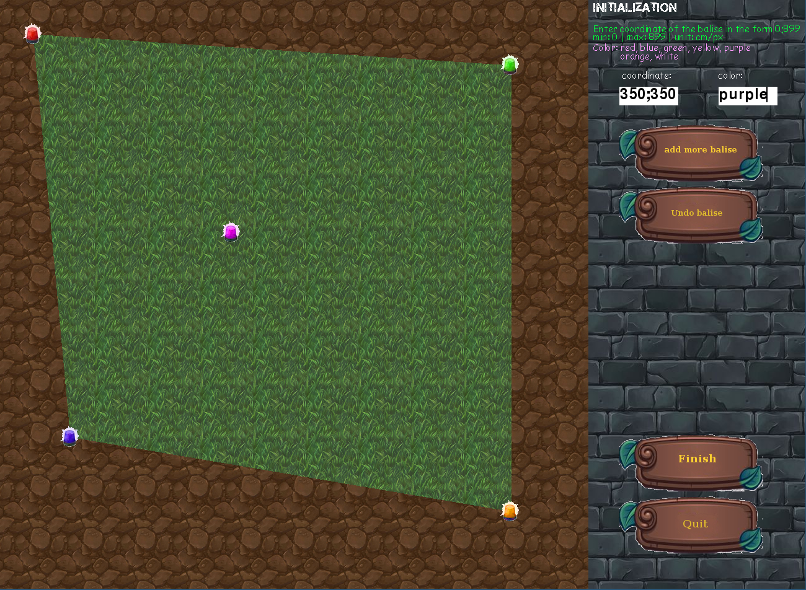
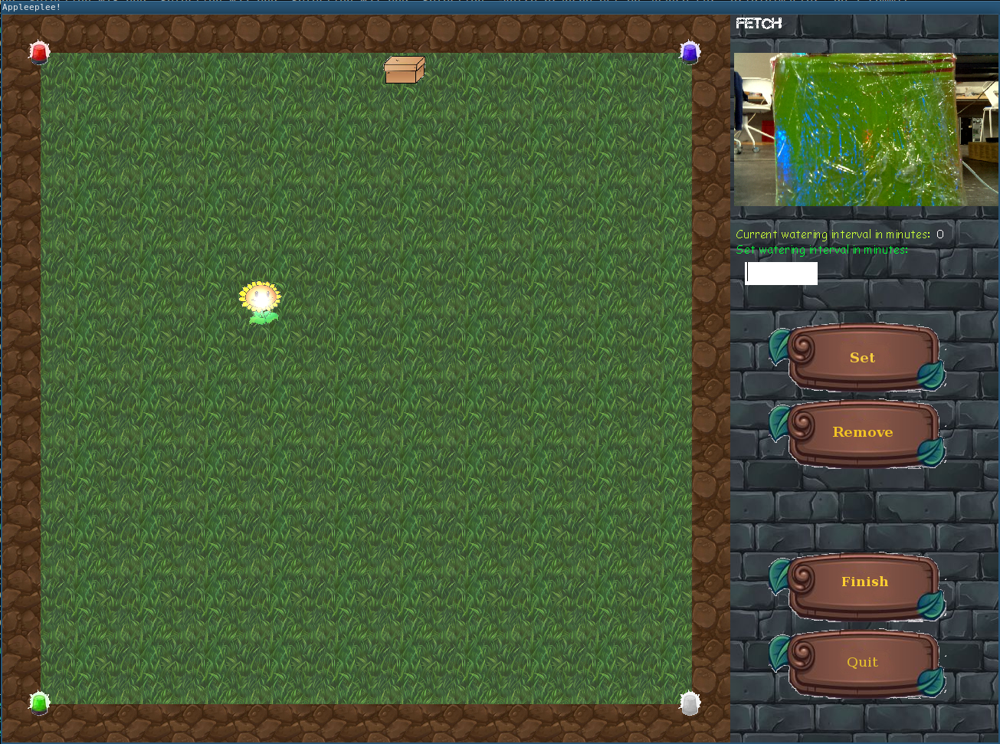

# The Project

We are three students soon-to-be system and embeded engineers.
PleePlee is a small gardener robot we are building for our master's project.

## Overview

This repository is about the graphical interface used to initialise and
configure the robot. The user fist has to initialize the map. Then after the setup phase of the
robot, it is used to correct mistakes and clarify the map. For example
the robot only recognize an obstacle, it will be the user job through this
interface to dissociate between plants and real obstacles. When processing the data fetched by the 
robot the user will also be able to setup interval watering for each plant.

## How to Build
This a python project to build it, just use the make command in the root of the repository. This will downloaded the needed package and run the application.

## How to Run

Use make in the source directory 

## Initialization

When you launch the application you must see a menu with 2 buttons. The first one is for the initialization
and the second one aims to fetch the data retrieved by the robot during the mapping. This size and dimension rely 
on the .config file in the source repository, all the user have to do is to provied the longest size of the garden.

Once the initialization is run, the user can add the balises that delimits the perimeter of the garden.
To add a balise you just have to enter its coordinate and color then click on the button "add balise".
When you are done with the main balises you can click on the "done" button. This, will draw the garden 
on the screen and let you add additionnals balises.

The user have to click on the "Finish" button to finalize the initialization. This action will create two files: data_json,
map.capture_init. At this point data_json contains in Json format, the positions of the different balises. On the other hand, map.capture_init contains an array of characters 'D' or 'G'. 'D' for dust, and 'G' for grass. This will later be overwritten by
the robot which will write 'P' when finding plants, and 'O' for obstacles. The initialization is done, to pass the data to the robot in a directory named "fetch".

## Fetch
Once the robot as done its mapping, you must retrieve the "fetch" directory with the new data_json and map.capture_init files.
The directory msut be at the root of the application repository. To start processing the fetched data, you must relaunch the application and click this time on the second button in the menu.

On the above screen, you can see the garden with a plant and a box drawn on it. This is because the robot during the mapping has encountered one plant and one obstacle. The user can now click on the plant to set it watering if this is a real plant and not a false positive. Otherwise it could delete it, to ignore it. The obstacles are visible to alert the detection of new object/obstacle in the garden. When an object is selected you can see its picture taken by the robot. To save all the change you can click on the "Finish" button.
